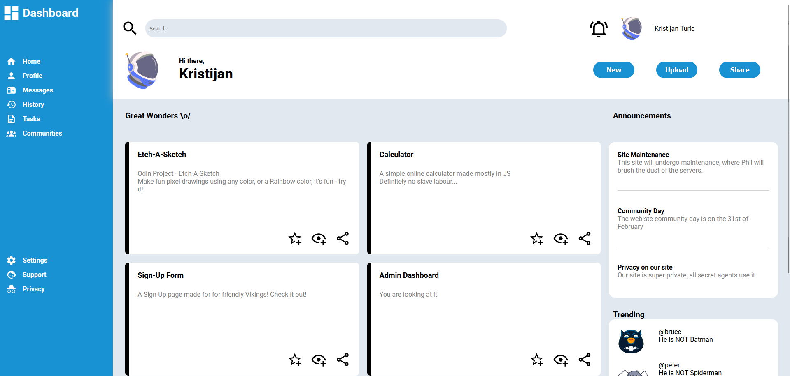

# Odin Project - Admin Dashboard

- [X] Make basic layout (sidebar - header - main content) using Grid
- [X] Fill out the whole layout using dummy content and placeholder images
  - [X] Sidebar
  - [X] Header
  - [X] Main Content
- [X] Style the design (color palettes, icons, images, fonts, etc.)
- [X] Publish the finished design to GitHub Pages

Demo: [Admin Dashboard](https://kristijanturic.github.io/odin-admin-dashboard/)

